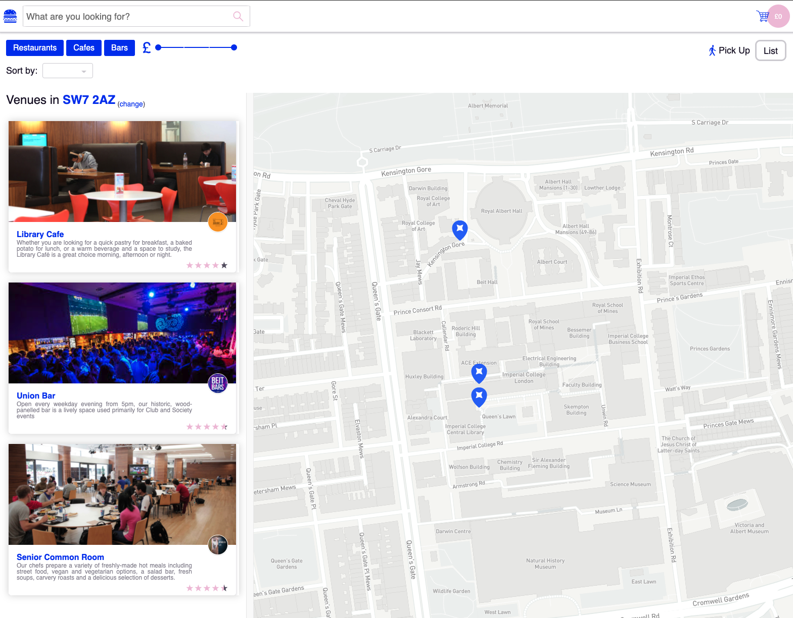
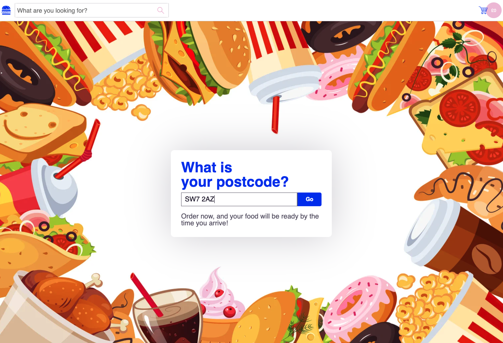
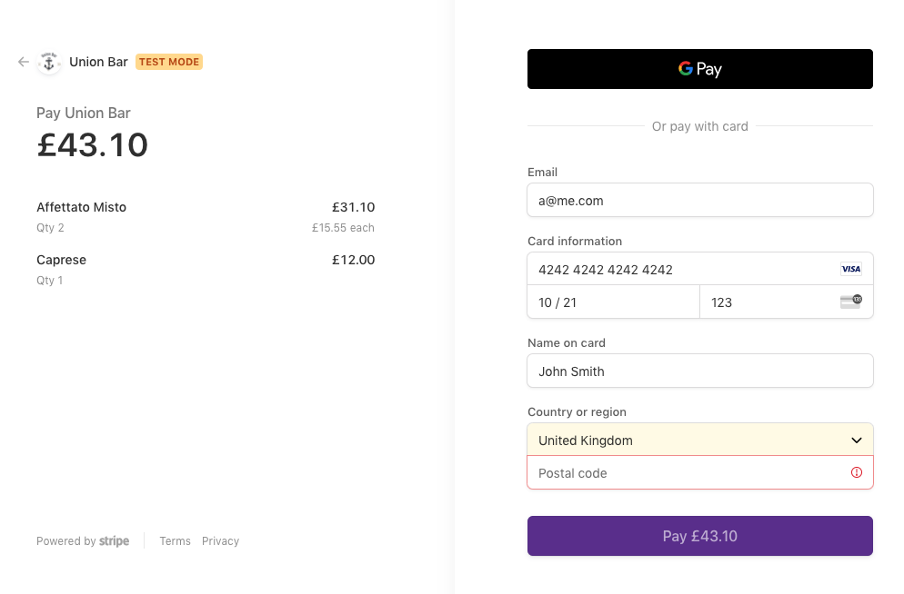

## Campus Cafe Collect (Backend Repository)
### A proof of concept web app for ordering and collecting food from Imperial's cafes

## Instructions
To use the application, open [this link](http://production.dolxjcfav4ei2.amplifyapp.com) in any browser.

**On landing,** enter the postcode **SW7 2AZ** to find restaurants that we have simulated.

**To make a payment,** enter the following card details:

*Name:* Anything

*Card Number:* 4242 4242 4242 4242

*Expiry Date:* Any future date

*CVC:* 123

**To retrieve order confirmation,** enter any valid email address.

